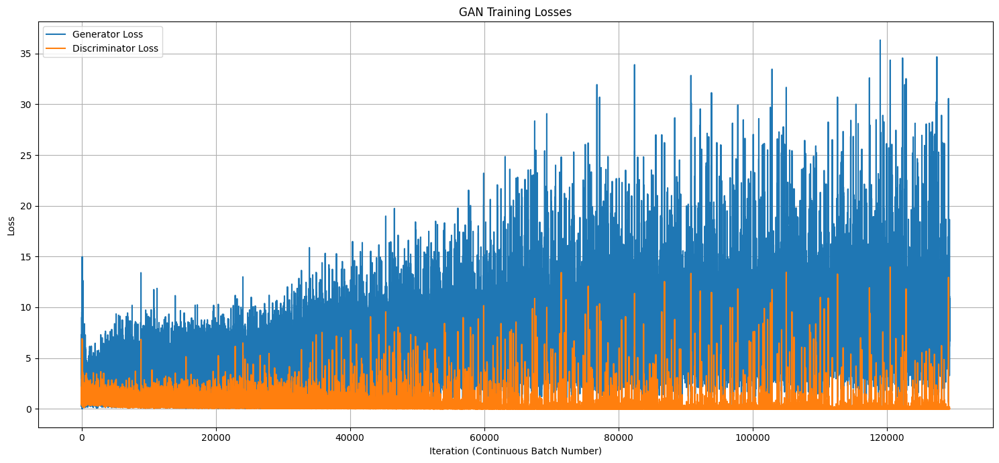
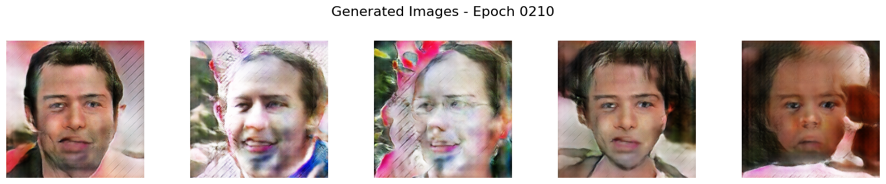

# Human Face Generation with Deep Convolutional GANs (DCGAN)

This project is an implementation of a Deep Convolutional Generative Adversarial Network (DCGAN) to generate realistic human faces. The model is built using TensorFlow and Keras and trained on a large dataset of real and fake face images.

## Project Overview

Generative Adversarial Networks (GANs) are a class of deep learning models where two neural networks, a Generator and a Discriminator, compete against each other. The Generator's goal is to create synthetic images that are indistinguishable from real images, while the Discriminator's goal is to accurately identify which images are real and which are fake. Through this adversarial process, the Generator becomes progressively better at producing high-quality, realistic images.

This project specifically implements the DCGAN architecture, which utilizes convolutional and transposed convolutional layers to learn the spatial hierarchies of features in images, making it particularly effective for image generation tasks.

## Dataset

The model was trained on the [140k Real and Fake Faces](https://www.kaggle.com/datasets/xhlulu/140k-real-and-fake-faces/data) dataset, which contains a diverse collection of human face images. The images were preprocessed by resizing to 64x64 pixels and normalizing the pixel values to be between -1 and 1.

## Model Architecture

The implementation consists of two main components:

* **Generator**: Takes a random noise vector as input and upsamples it through a series of transposed convolutional layers to generate a 64x64 pixel image. It uses `ReLU` activation functions in its hidden layers and a `tanh` activation function in the output layer.
* **Discriminator**: Takes a 64x64 pixel image as input and processes it through a series of convolutional layers to classify it as either "real" or "fake". It uses `LeakyReLU` activation functions to prevent sparse gradients.

The Adam optimizer was used for training both networks.

## Technologies and Libraries Used

* **Python**
* **TensorFlow & Keras**: For building and training the DCGAN model.
* **NumPy**: For numerical operations and data manipulation.
* **Matplotlib**: For visualizing the generated images and training progress.
* **OS & Glob**: For dataset path management.

## How to Use

To get this project running on your local machine, follow these steps.

1.  **Clone the repository:**
    ```bash
    git clone [https://github.com/your-username/your-repository-name.git](https://github.com/your-username/your-repository-name.git)
    ```
2.  **Install the required dependencies:**
    ```bash
    pip install tensorflow numpy matplotlib
    ```
3.  **Run the Jupyter Notebook:**
    Open and execute the `dc_gan_model.ipynb` notebook within a Jupyter environment. Ensure your dataset is correctly placed as per the paths in the notebook.

## Results

The model was trained for 60 epochs. Below is a visualization of the generator's and discriminator's loss over time, along with a sample of the faces generated by the model at the end of the training.

### Model Loss
The training loss for both the generator and discriminator fluctuated, which is typical for GAN training, indicating the competitive dynamic between the two networks.
<br>

<br>

### Generated Faces
Here are some of the faces generated by the trained model. While not perfect, they demonstrate the model's ability to learn and reproduce key facial features.
<br>

<br>

This project serves as a practical implementation of the DCGAN architecture and highlights the challenges and nuances of training generative models.

## License

This project is licensed under the MIT License. See the `LICENSE` file for more details.
